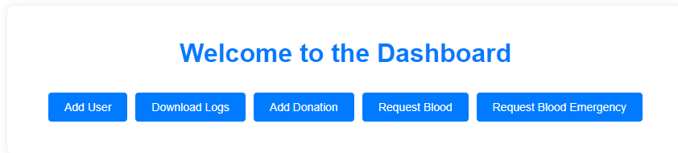
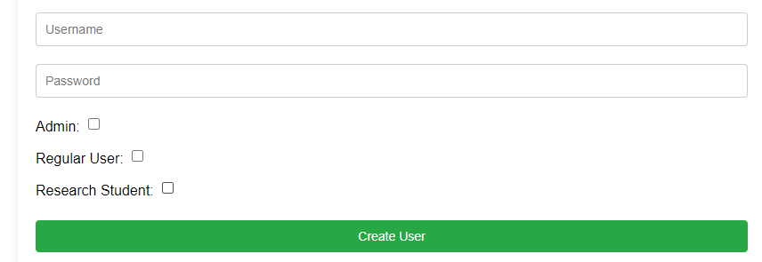
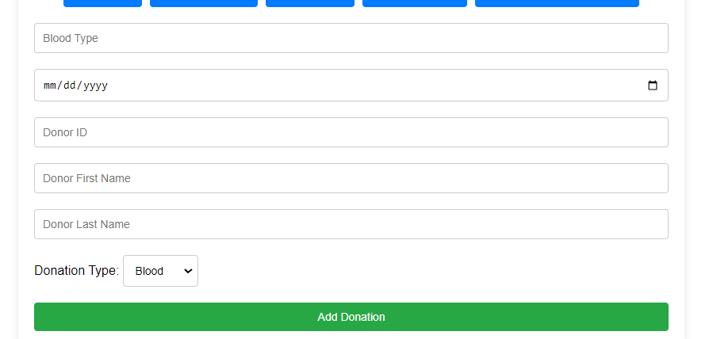
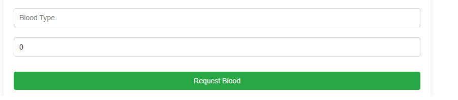
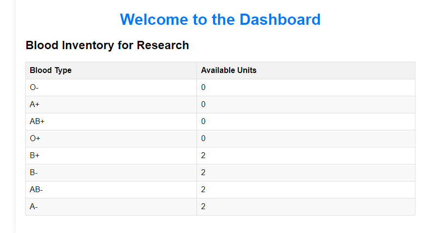

# BECS

Blood Donation Management System

Description:
The Blood Donation Management System is a web application for managing blood donations and inventory. It includes features for adding donations, requesting blood, and handling emergency blood requests.

Prerequisites
Node.js (version 14 or above)
PostgreSQL

Installation:

# Install backend dependencies

cd backend
npm install

# Install frontend dependencies

cd ../frontend
npm install

Setup PostgreSQL Database:
-Create a PostgreSQL database:
-in folder backend/config/config.json (create if you haven't) create json with db configuration accordance with your settings
for example:

{

"development": {
"username": "postgres",
"password": "your_password",//depend on your postgres //password
"database": "becs",
"host": "127.0.0.1",
"port": 5432,
"dialect": "postgres"
},

"test": {
"username": "postgres",
"password": "your_password",
"database": "testdatabase",
"host": "127.0.0.1",
"port": 5432,
"dialect": "postgres"
},

"production": {
"username": "postgres",
"password": "your_password",
"database": "productiondatabase",
"host": "127.0.0.1",
"port": 5432,
"dialect": "postgres"
}
}

Run Migrations and Seeders:

# Navigate to the backend directory

cd backend

# Run migrations

npx sequelize-cli db:migrate

# Run seeders

npx sequelize-cli db:seed:all

Start the Backend Server:

# Make sure you are in the backend directory

cd backend
node app.js

# Start the Frontend Server:

# Navigate to the frontend directory

cd ../frontend
npm run dev

# Usage:

Add Donation: Navigate to the "Add Donation" form to add a new blood donation to the system.
Request Blood: Navigate to the "Request Blood" form to request a specific type and amount of blood.
Request Blood Emergency: Use the "Request Blood Emergency" form to request an unlimited amount of O- blood in case of emergencies.

# Addition for 2-nd task

Logging User Actions and Exporting Logs

We have implemented detailed logging for user actions related to blood donation and requests. Each time a user performs an action such as adding a donation, requesting blood, or requesting blood in an emergency, a log entry is created. This log includes details about the action, as well as the username of the individual who performed it.

Additionally, we have provided an export feature available to admin users. Admins can download all the logs in PDF format through the dashboard. This allows for easy tracking and auditing of all activities within the system.

# Addition for 3-nd task

User Roles
The program is divided into three types of users:

Admin:

Has access to all options, including:
Adding new users.
Downloading audit logs.
Adding blood donations.
Requesting blood.
Requesting blood for emergencies.

Regular User:

Has access to the following options:
Requesting blood.
Requesting blood for emergencies.

Research Student:

Can only view information about the available blood inventory by blood type.
Personal data of blood donors is not visible to this user role.

# images from program

# admin dashboard

# add user

# blood donation

# request blood

# research student page

